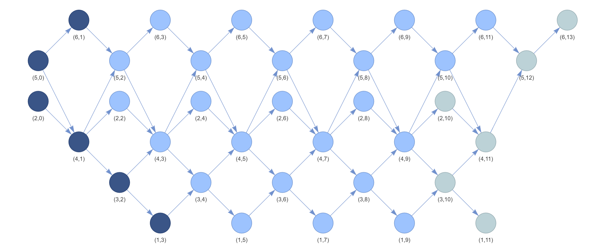

# ARQuiverPainter

This project is for drawing Auslander-Reiten quiver (only for path algebras of Dynkin type now).


**Example 1**

Input:

```
5
1 2
2 3
3 4
4 5
```

Output:


Dark blue for projective objects, light green for injective objects, and light yellow for both projective and injective objects. Additionally, you can move your mouse on some verticies to see their dimensional verctors.

**Example 2**

Input:

```
6
1 3
3 4
4 2
4 5
6 5
```

Output:

